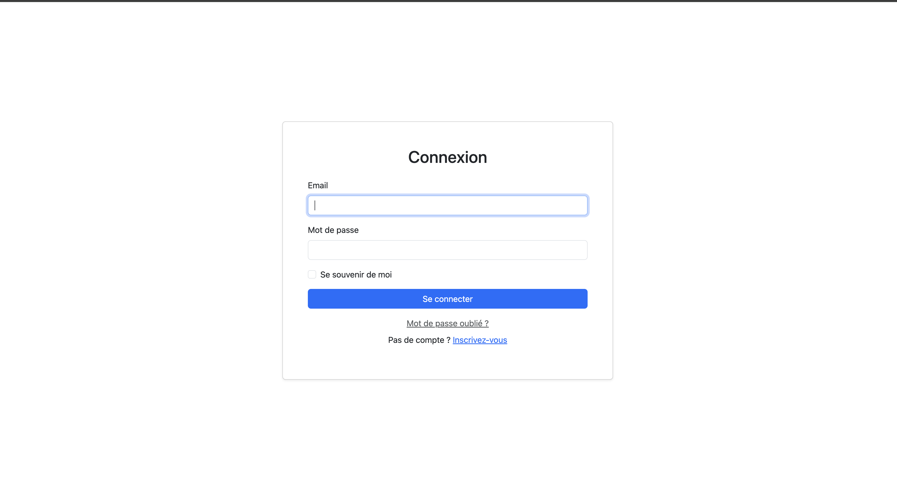
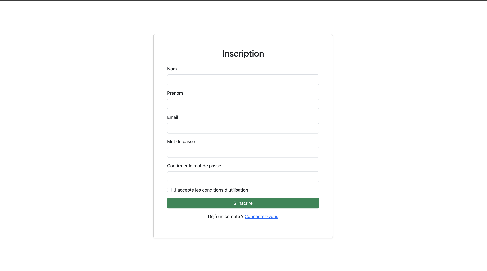
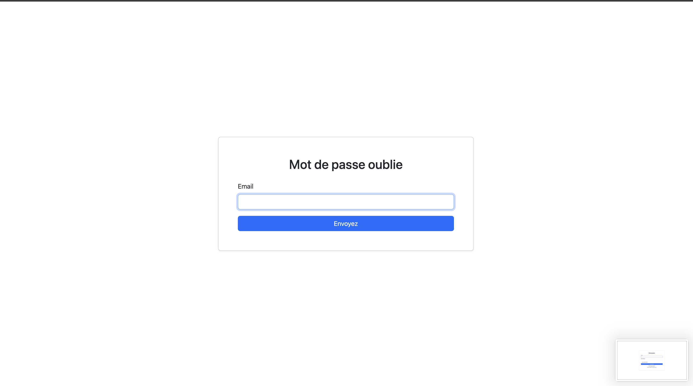
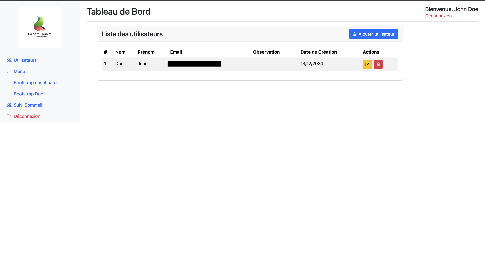
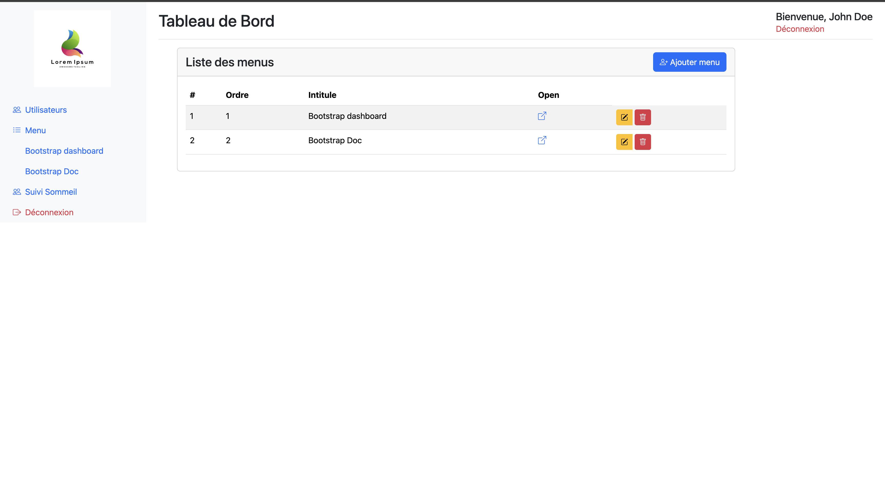
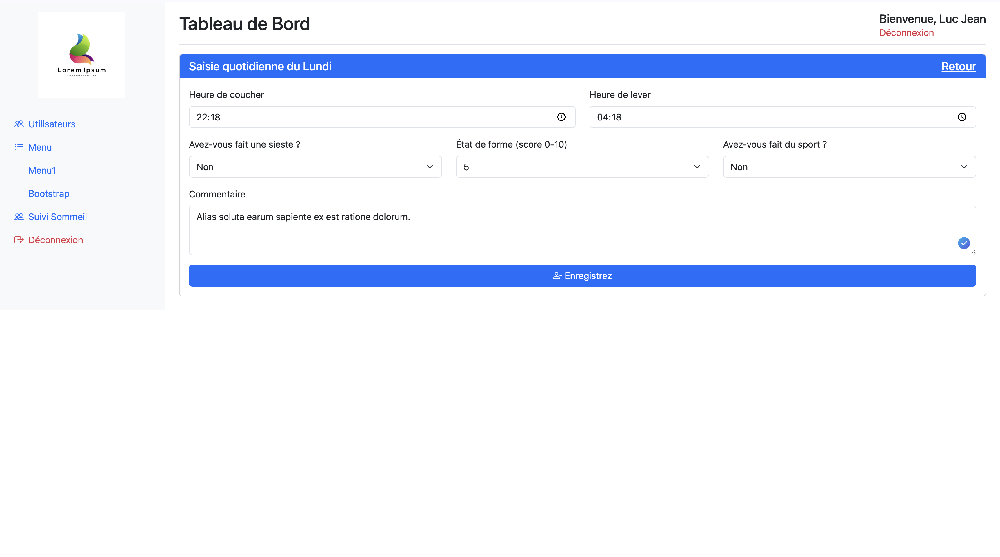
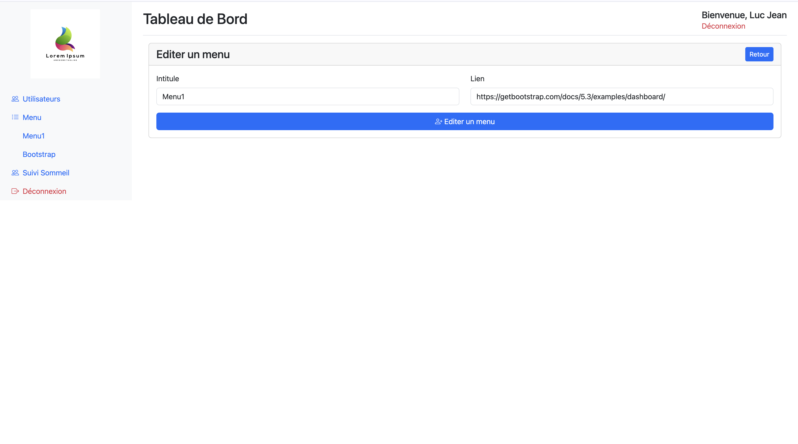
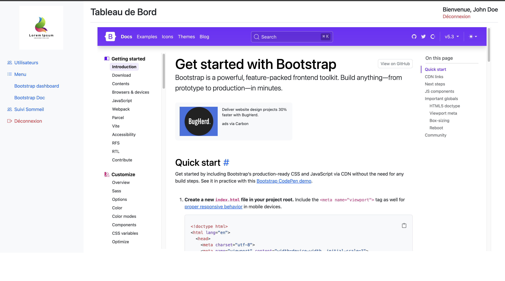

# Project Overview

This project is a web application built using Laravel, Bootstrap, and MySQL. The application provides user
authentication, menu management, and sleep tracking functionalities. Below is a detailed description of the features and
functionality implemented.

## Technologies Used

- **Laravel**: Backend framework for application logic and database management.
- **Bootstrap**: Frontend framework for responsive and aesthetic UI design.
- **MySQL**: Relational database for storing application data.

---

|  |  |  |  |    |
|---------------------------------------------|---------------------------------------------|---------------------------------------------|---------------------------------------------|-----------------------------------------------|
|  |  |  |  |  |

---

## Features

### Authentication

- **Registration**: Users can create accounts using a simple registration form.
- **Login**: Secure login functionality with validation.
- **Forgot Password**: Password recovery through email.
- **User Management**:
    - Add a new user.
    - Edit user details.
    - Delete a user.

### Menu Management

- **Create Menu**: Users can create a menu entry.
- **Edit Menu**: Modify the details of an existing menu.
- **View Menu URL**: Display the URL linked to a menu.
- **Delete Menu**: Remove an existing menu entry.

### Sleep Tracking

- **Daily Sleep Data Input**:
    - Bedtime.
    - Wake-up time.
    - Morning state (e.g., formal or casual).
    - Physical activity (whether the user exercises).
    - Napping (if the user takes naps).
    - Additional comments.
    - Input data for each day of the week (Monday to Sunday).

- **Weekly Sleep Cycle Calculation**:
    - Calculate weekly sleep cycles.
    - Identify sequences of 5 consecutive sleep cycles.

- **Statistics and Insights**:
    - Percentage-based analysis of sleep cycles.
    - Evolution curve for morning state.
    - Correlation between sleep duration and morning state.
    - Total sleep duration.

---

## How to Run the Project

1. **Clone the Repository**:
   ```bash
   git clone https://github.com/dongorias/TpUserFlow.git
   ```
2. **Install Dependencies**:
   ```bash
   composer install
   npm install
   ```
3. **Setup Environment Variables**:
    - Configure the `.env` file for database and mail settings.

4. **Run Database Migrations**:
   ```bash
   php artisan migrate
   ```
5. **Start the Development Server**:
   ```bash
   php artisan serve
   ```
6. **Access the Application**:
    - Open `http://localhost:8000` in your browser.

---

## Future Enhancements

- Add more advanced analytics for sleep tracking.
- Implement user roles and permissions.
- Enhance the UI/UX for better usability.

---

## License

This project is open-source and available under the [MIT License](https://fr.wikipedia.org/wiki/Licence_MIT).

---

Feel free to contribute to this project or suggest improvements!

